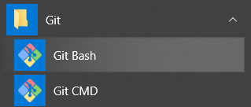
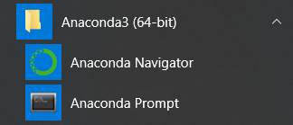

# Installing the Allen Institute Brain Modeling Toolkit (BMTK)

*This page is part of a [collection of pages](https://cyneuro.github.io/) on various topics of Computational Neuroscience. Please direct questions and suggestions to [tbanks@mail.missouri.edu](mailto:tbanks@mail.missouri.edu).*


## About BMTK

The Brain Modeling Toolkit ([BMTK](https://alleninstitute.github.io/bmtk/)) is a python-based software package for creating and simulating large-scale neural network models. It supports building, simulation and analysis of models of different levels of resolution including:

* Biophysically detailed networks.
* Point neuron networks.
* Filter models.
* Population-level networks.

The BMTK was developed and is supported at the Allen Institute for Brain Science and released under a BSD 3-clause license. We encourage others to use the BMTK for their own research, and suggestions and contributions to the BMTK are welcome.

The latest release, previous releases, and current development can be found at:

[https://github.com/AllenInstitute/bmtk](https://github.com/AllenInstitute/bmtk)


## Installation

1.	You must have Anaconda3 and Neuron installed correctly for BMTK to work. Details at the end of this document.
2.	You must also install a git client to get the latest BMTK code. Download and install Git for Windows at [https://git-scm.com/download/win](https://git-scm.com/download/win) and install with all the default settings.
3.	From the ‘<mark>**Git Bash**</mark>’ prompt installed earlier execute the following commands:


```
cd C:/Users/<your_username>/Desktop
mkdir temp_bmtk_install
cd temp_btmk_install
git clone https://github.com/AllenInstitute/bmtk

```
<mark>Now close the Git Bash Window</mark>


4. Next, run **setup** and **install** from the <mark>**Anaconda Prompt**</mark> (We will also ensure that **old versions of BMTK are removed too**)


```
cd C:\Users\<your_username>\Desktop\temp_bmtk_install\bmtk
pip uninstall bmtk
python setup.py install

```
You can now safely delete the temp_bmtk_install directory using the command 

```
cd ../..
rd /s /q C:\Users\<your_username>\Desktop\temp_bmtk_install

```

## Additional Information

* Main reference for BMTK and BioNet:  Gratiy et al. (2018) BioNet: A Python interface to NEURON for modeling large-scale networks. PLoS ONE 13(8): e0201630.
* BMTK is a python-based API to interface with NEURON, NEST
* API (Application Programming Interface) is a protocol intended to be used as an interface by software components to communicate with each other. It is basically a set of programming instructions and standards for accessing web-based applications or web tools.
* JSON (Java Script Object Notation) is a lightweight data-interchange format. It is easy for humans to read and write. It is easy for machines to parse and generate. It is based on the Java programming language, Standard ECMA-262 3rd edition, Dec 1999
* See document "Additional_BMTK_info" for additional information
