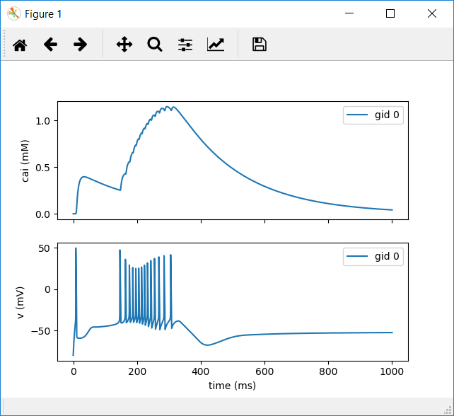

# Single Cell HOC in BMTK

*This page is part of a [collection of pages](https://cyneuro.github.io/) on various topics of Computational Neuroscience. Please direct questions and suggestions to the author Tyler Banks at [tbanks@mail.missouri.edu](mailto:tbanks@mail.missouri.edu).*


## Instructions

<mark>This document assumes you have completed the necessary steps in [Installing BMTK](/bmtk/installation/)</mark>

## Setup

1. Now that BTMK is installed, visit the directory you want to **build** your model in and run BMTK’s directory setup. The network directory is where the node/edge configuration files will sit. For example, the following will change directory to your desktop, create a project directory (bmtk_model), create a network directory for btmk to use, and initialize the directory for your further customization. **<mark>This step will only be run once!</mark>**

``` line-numbers
cd C:\Users\<your_username>\Desktop
mkdir my_bmtk_model
cd my_bmtk_model
mkdir network
python -m bmtk.utils.sim_setup -n ./network bionet
```

This will create the bmtk directory structure at the present location "$BASE_DIR", and create the following files and nested directories:

Nested directories: 
* biophys_coponents
* network
* output

Json files: 
* circuit_config.json
* simulation_config.json


2. In Windows you may be met with compilation errors like the following:

```
C:\Users\Tyler\Desktop\my_bmtk_model\biophys_components\mechanisms

Was unable to compile mechanism in $COMPONENTS_DIR/mechanisms
```

This is normal. However, you will need to compile your mod files manually, any time they change. 

To do so, run <mark>mknrndll</mark> in the (```\biophys_components\mechanisms\modfiles\```) directory then copy the resulting dll file to the parent directory (```\biophys_components\mechanisms\```)

## HOC Build

1. HOC template files can be used by BMTK. For this example, we'll take a single HCO cell and run it with no input, in BMTK.

2. Download the HCO files from [https://github.com/tjbanks/two-cell-hco/archive/master.zip](https://github.com/tjbanks/two-cell-hco/archive/master.zip) 

3. Extract the files in the zip directory and copy all .mod files into (```.\biophys_components\mechanisms\modfiles\```)

4. Run nrnmkdll in 
(```.\biophys_components\mechanisms\modfiles\```)

5. Next, tell BMTK where to find your template files. <mark>In the root of your model directory</mark>, edit **<mark>circuit_config.json</mark>**. Add the ```templates_dir``` key under components. Your file should look similar to the following: 

```circuit_config.json```
```json
{
  "manifest": {
    "$BASE_DIR": ".",
    "$COMPONENTS_DIR": "$BASE_DIR/biophys_components",
    "$NETWORK_DIR": "$BASE_DIR\\network"
  },
  "components": {
    "morphologies_dir": "$COMPONENTS_DIR/morphologies",
    "synaptic_models_dir": "$COMPONENTS_DIR/synaptic_models",
    "mechanisms_dir": "$COMPONENTS_DIR/mechanisms",
    "biophysical_neuron_models_dir": "$COMPONENTS_DIR/biophysical_neuron_templates",
    "point_neuron_models_dir": "$COMPONENTS_DIR/point_neuron_templates",
    "templates_dir":"$COMPONENTS_DIR/hoc_templates"
  },
  "networks": {
    "nodes": [],
    "edges": []
  }
}
```

6. <mark>Create a </mark>**<mark>hoc_templates</mark>**<mark> directory</mark> under ```./biophys_components```

7. <mark>Create a new file named </mark>**<mark>HCOCell.hoc</mark>**<mark> in your new hoc_templates directory</mark> and paste the following code into that file:

```HCOCell.hoc```

begintemplate HCOcell

    public NumSoma
    NumSoma = 1
    public soma	// declares object soma is a public object that can be accessed by any procedures/functions
	create soma[NumSoma]	// declares soma as a membrane compartment object
	
    public all, somatic, basal, apical, axonal

    objref all, somatic, basal, apical, axonal
    objref this
    
    

	proc init() {
                
        all = new SectionList()
        somatic = new SectionList()
        basal = new SectionList()
        apical = new SectionList()
        axonal = new SectionList()
        
        
        for i=0,NumSoma soma[i] { all.append()
            somatic.append()} 
                	
		/////// geometrical properties //////
		soma[0] {
			nseg=1	// create only one segment in the soma
			// gives area of .628e-3 cm^2
			L=1000		// (micrometer)
			diam=9.99593	// (micrometer)
	    	}
		
		/////// biophysical properties //////
		soma[0] {
			cm = 1	// (microF/cm2)
			
			//insert the appropriate channels and give them reversal potentials and conductances
			insert leak
			insert cat
			insert cas
			insert kdr
			insert ka
			insert kca
			insert capool
			insert hyper
			
			eleak = -50 // (mV)
			gbar_leak = .03e-3 // (siemens/cm2)
			
			cao = 3
			cai = 50e-6
			gbar_cat = .02 //(.005~.01 siemens/cm2)
			gbar_cas = .01 //(.001~.005 siemens/cm2)
			
			ek = -80
			gbar_kdr = .1 // (.1~.5 siemens/cm2)
			gbar_ka = .3 // (.1~.5 siemens/cm2)
			gbar_kca = .01 //// (.01~.05 siemens/cm2)
			
			eh=-20
			gbar_hyper = .0002 // (.0001~.0003 siemens/cm2)
			
			insert na
			ena = 50		// (mV)
			gbar_na = 0.5	// (siemens/cm2)
			
		}
        
        define_shape()
	
	}
endtemplate HCOcell
```


8. Things to note about this file:

a. There are public section references used by bmtk:
* Line 11: ```public all, somatic, basal, apical, axonal```

b. The sections are indexable, i.e., soma is not a single object but an array.

* Line 8: ```create soma[NumSoma]```
* Line 27: append your sections to the correct section list
```
for i=0,NumSoma soma[i] { all.append()
            somatic.append()} 
```

c.	This can be any hoc file that specifies a template. This will be where a good majority of your model customization will be.

d.	**<mark>Line 75: ```define_shape()``` must be called</mark>** if you don’t define a 3d morphology in the hoc otherwise. BMTK relies heavily on 3d locations.

9. Something <u>important</u> which may be a limitation of BMTK: the morphology file is ALWAYS required. For any hoc file loaded you must specify an swc, however, it can be a blank file, as it will be **ignored**. <mark>Create the ```blank.swc``` file</mark> in ```.\biophys_components\morphologies``` and leave this file blank.

```blank.swc```
```
```

10. Next, you’ll need to create a cell builder script to tell BMTK the type of cells you want to use. <mark>Create the file </mark>**<mark>build_network.py </mark>**<mark>in the root of your directory and add the following code:</mark>

```build_network.py```

```python

from bmtk.builder.networks import NetworkBuilder

net = NetworkBuilder('hco_net')
net.add_nodes(cell_name='HCOCell',
              model_type='biophysical',
              model_template='hoc:HCOcell',
              morphology='blank.swc',
              HCOCell='HCOCell'
            )
net.build()
net.save_nodes(output_dir='network')

```

11. Now you should be ready to build your network. <mark>In your Anaconda Prompt</mark>, in the root of your directory <mark>execute the following command</mark> to build your network:

```
python build_network.py
```

A successful run may not have any output.


12. Before running your simulation <u>you will need to tell BMTK which generated network files are to be used in your simulation</u>. <mark>ANY time you change your network configuration (networks, edges, etc) this will need to be updated</mark>. These files were generated in the previous step and exist in the network directory. <mark>Edit </mark>**,<mark>circuit_config.json</mark>**. Add the appropriate "```networks```" key values that correspond to the files generated in the network directory. Your file should look like the following:

```circuit_config.json```
```json

{
  "manifest": {
    "$BASE_DIR": ".",
    "$COMPONENTS_DIR": "$BASE_DIR/biophys_components",
    "$NETWORK_DIR": "$BASE_DIR\\network"
  },
  "components": {
    "morphologies_dir": "$COMPONENTS_DIR/morphologies",
    "synaptic_models_dir": "$COMPONENTS_DIR/synaptic_models",
    "mechanisms_dir": "$COMPONENTS_DIR/mechanisms",
    "biophysical_neuron_models_dir": "$COMPONENTS_DIR/biophysical_neuron_templates",
    "point_neuron_models_dir": "$COMPONENTS_DIR/point_neuron_templates",
    "templates_dir":"$COMPONENTS_DIR/hoc_templates"
  },
  "networks": {
    "nodes": [
      {
        "nodes_file": "$NETWORK_DIR\\hco_net_nodes.h5",
        "node_types_file": "$NETWORK_DIR\\hco_net_node_types.csv"
      }
    ],
    "edges": [
    ]  }
}
```


13. An <mark>important step</mark> needed for the network to run correctly: BMTK will need to have its default hoc loader overridden. You do this by editing your **<mark>```run_bionet.py```</mark>** file to add the following code:

```python
from bmtk.simulator.bionet.default_setters.cell_models import loadHOC

bionet.pyfunction_cache.add_cell_model(loadHOC, directive='hoc', model_type='biophysical')
```

The resulting file should look similar to the following:

```run_bionet.py```
```python
# -*- coding: utf-8 -*-

"""Simulates an example network of 14 cell receiving two kinds of exernal input as defined in configuration file"""

import os, sys
from bmtk.simulator import bionet
from bmtk.simulator.bionet.default_setters.cell_models import loadHOC

bionet.pyfunction_cache.add_cell_model(loadHOC, directive='hoc', model_type='biophysical')

def run(config_file):
    conf = bionet.Config.from_json(config_file, validate=True)
    conf.build_env()

… 

```

14. Finally, <mark>run the simulation by executing the following in your Anaconda prompt, in the root of your project directory:</mark>

```
python run_bionet.py simulation_config.json
```

A successful run will output something like the following:

```
(clean) C:\Users\Tyler\Desktop\my_bmtk_model>python run_bionet.py simulation_config.json
2018-12-30 20:23:31,719 [INFO] Created log file
2018-12-30 20:23:31,779 [INFO] Building cells.
C:\Users\Tyler\Anaconda3\envs\clean\lib\site-packages\bmtk-0.0.7-py3.7.egg\bmtk\simulator\bionet\morphology.py:61: RuntimeWarning: invalid value encountered in true_divide
  r3dsoma /= n3dsoma
2018-12-30 20:23:31,796 [INFO] Building recurrent connections
2018-12-30 20:23:31,804 [INFO] Running simulation for 1000.000 ms with the time step 0.001 ms
2018-12-30 20:23:31,804 [INFO] Starting timestep: 0 at t_sim: 0.000 ms
2018-12-30 20:23:31,810 [INFO] Block save every 5000 steps
2018-12-30 20:23:31,929 [INFO]     step:5000 t_sim:5.00 ms
2018-12-30 20:23:32,061 [INFO]     step:10000 t_sim:10.00 ms
2018-12-30 20:23:32,165 [INFO]     step:15000 t_sim:15.00 ms
2018-12-30 20:23:32,231 [INFO]     step:20000 t_sim:20.00 ms
…
2018-12-30 20:23:49,841 [INFO]     step:985000 t_sim:985.00 ms
2018-12-30 20:23:50,006 [INFO]     step:990000 t_sim:990.00 ms
2018-12-30 20:23:50,156 [INFO]     step:995000 t_sim:995.00 ms
2018-12-30 20:23:50,316 [INFO]     step:1000000 t_sim:1000.00 ms
2018-12-30 20:23:50,357 [INFO] Simulation completed in 18.55 seconds
```

15. If you receive "PermissionError: [WinError 5] Access is denied:'./output'" just run the network again by repeating the previous step.

16. At this point your network should have ran. From here we can customize the output and view results. 

17. Edit the **reports** section of the **```simulation_config.json```** file in the root of your model directory to look like:

```simulation_config.json```
```json
...

"reports": {
      "membrane_report": {
      "module": "membrane_report",
      "cells": "all",
      "variable_name": [
        "cai",
        "v"
      ],
      "file_name": "cell_vars.h5",
      "sections": "soma"
    }
},

...
```

18. This will instruct BMTK to log the calcium and voltage levels for your cell.
Run your network again, as we did previously, with (```python run_bionet.py simulation_config.json```)

19. <mark>Create a new file named </mark>**<mark>```plot_test.py```</mark>** in the root of your directory and paste the following code into it:

```plot_test.py```
```python

from bmtk.analyzer.cell_vars import plot_report

plot_report(config_file='simulation_config.json')
 
```

20. Executing this file with (```python plot_test.py```) will return a plot like the following:



## Additional Resources
For additional resources and instructions on configuring BMTK see: https://github.com/AllenInstitute/bmtk/blob/develop/docs/tutorial/Simulation_Intro.ipynb
