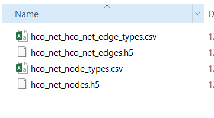
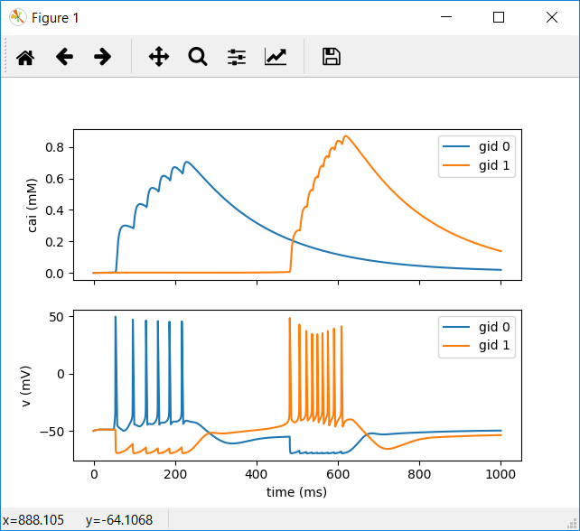

# Networked HOC in BMTK

[**Home**](/) > [**Research**](/research) > [**BMTK**](/research/bmtk) > [**Networked HOC in BMTK**](./)

---

## Instructions

<mark>This document assumes you have completed the necessary steps in </mark>[Single Cell HOC BMTK](/bmtk/single-cell/)

A completed model based on these instructions can be downloaded [here](../single-cell/my_bmtk_model.zip). 

This document will walk you through connecting two cells to form an oscillating network.

## Setup

1.) To keep our previous model intact we’ll create a whole new set of configuration files.

2.) Start by creating a <mark>new</mark> ```build_network1.py``` script and paste the following code into that file:

build_network1.py
---------

```python
bmtk.builder.networks import NetworkBuilder

net1 = NetworkBuilder('hco_net')
net1.add_nodes(N=1, 
              cell_name='HCOCell1',
              model_type='biophysical',
              model_template='hoc:HCOcell',
              morphology='blank.swc'
            )
            
net1.add_nodes(N=1, 
              cell_name='HCOCell2',
              model_type='biophysical',
              model_template='hoc:HCOcell',
              morphology='blank.swc'
            )
                                    
net1.add_edges(source={'cell_name': 'HCOCell1'}, target={'cell_name':'HCOCell2'},
              connection_rule=1,
              syn_weight=40.0e-02,
              dynamics_params='GABA_InhToInh.json',
              model_template='Exp2Syn',
              delay=0.0,
              target_sections=["soma"],
              distance_range=[0,999])
              
net1.add_edges(source={'cell_name': 'HCOCell2'}, target={'cell_name':'HCOCell1'},
              connection_rule=1,
              syn_weight=40.0e-02,
              dynamics_params='GABA_InhToInh.json',
              model_template='Exp2Syn',
              delay=0.0,
              target_sections=["soma"],
              distance_range=[0,999])

net1.build()
net1.save_nodes(output_dir='network')             
              
net1.build()
net1.save_edges(output_dir='network')
```

3.) Things to note about this new file:

>a. Line 4: ‘hco_net’ will be used for network component files later, be descriptive

>b.	The cell name ‘hco1’ and ‘hco2’ have been assigned to nodes that have been added to keep the cells separate

>c.	Line 12: We can call ```add_nodes``` more than once

>d.	Line 19: The ```add_edges``` method creates connections between cells

* Line 19: Specify the source cells via parameters of that cell, set in the previous ```add_nodes``` call. You can specify multiple conditions for that cell to connect.
* Line 20: Target cells can be set in the same way. <mark>When using multiple networks</mark>, specify the target (or source) in the following way:

```
target=otherNetwork.nodes(cell_name=”poolosyn_cell”)
```
* Line 23: dynamics_params specifies a file located in ```\biophys_components\synaptic_models```. That file will contain information in the following way, and can be duplicated or modified: <mark>For now, this file exists and does not need to be modified</mark>.

GABA_InhToInh.json
---------

```json
{
  "level_of_detail": "exp2syn",
  "tau1": 0.2,
  "tau2": 8.0,
  "erev": -70.0
}
```

>e. Line 42 and 43. Just as the nodes were saved to the network directory, we must also save the edges.

>f. We can specify a different output folder for our network components for multiple simulations, but we won’t here.


4.) Now you should be ready to build your network. <mark>In your Anaconda Prompt</mark>, in the root of your directory <mark>execute the following</mark> command to build your network:

```
python build_network1.py
```

A successful run may not have any output.

5.) Visit your network directory (```network```) You should have several files for nodes and edges. Make note of the files listed:



6.) It’s now time to create a <mark>new</mark> circuit config file, create a file named ```circuit_config1.json```. Copy the contents from your previous ```circuit_config.json``` file and update the node/edge references. The files referenced here are from the previous step. Your file should like to the following:

circuit_config1.json
---------

```json
{
  "manifest": {
    "$BASE_DIR": ".",
    "$COMPONENTS_DIR": "$BASE_DIR/biophys_components",
    "$NETWORK_DIR": "$BASE_DIR\\network"
  },
  "components": {
    "morphologies_dir": "$COMPONENTS_DIR/morphologies",
    "synaptic_models_dir": "$COMPONENTS_DIR/synaptic_models",
    "mechanisms_dir": "$COMPONENTS_DIR/mechanisms",
    "biophysical_neuron_models_dir": "$COMPONENTS_DIR/biophysical_neuron_templates",
    "point_neuron_models_dir": "$COMPONENTS_DIR/point_neuron_templates",
    "templates_dir":"$COMPONENTS_DIR/hoc_templates"
  },
  "networks": {
    "nodes": [
      {
        "nodes_file": "$NETWORK_DIR\\hco_net_nodes.h5",
        "node_types_file": "$NETWORK_DIR\\hco_net_node_types.csv"
      }
    ],
    "edges": [
      {
        "edges_file": "$NETWORK_DIR\\hco_net_hco_net_edges.h5",
        "edge_types_file": "$NETWORK_DIR\\hco_net_hco_net_edge_types.csv" 
      }
    ]
  }
}

```

7.) Things to note about ```circuit_config1.json```

* When using multiple networks and multiple edges between networks you will need to have multiple blocks of node_file/node_type_file enclosed by brackets, separated by commas.

8.) Next we’ll set up our simulation by creating a <mark>new</mark> simulation configuration file (```simulation_config1.json```) You can either copy your old configuration file into this and edit it or copy the following:

simulation_config1.json
---------

```json
{
  "manifest": {
    "$BASE_DIR": ".",
    "$OUTPUT_DIR": "$BASE_DIR/output"
  },
  "target_simulator": "NEURON",
  "run": {
    "tstop": 1000.0,
    "dt": 0.1,
    "dL": 20.0,
    "spike_threshold": -15.0,
    "nsteps_block": 5000
  },
  "conditions": {
    "celsius": 34.0,
    "v_init": -50.0
  },
  
  "node_sets": {
    "hco1": {
      "cell_name": "HCOCell1"
    }
  },

  "inputs": {
  "current_clamp": {
      "input_type": "current_clamp",
      "module": "IClamp",
      "node_set": "hco1",
      "amp": 1.0,
      "delay": 50.0,
      "duration": 10.0
    }
  },
  "output": {
    "log_file": "log.txt",
    "output_dir": "${OUTPUT_DIR}",
    "spikes_file": "spikes.h5",
    "spikes_file_csv": "spikes.csv",
    "overwrite_output_dir": true
  },
  "reports": {
      "membrane_report": {
      "module": "membrane_report",
      "cells": "all",
      "variable_name": [
        "cai",
        "v"
      ],
      "file_name": "cell_vars.h5",
      "sections": "soma"
    }
},
  "network": "./circuit_config1.json"
}

```

9.) Things to note about ```simulation_config1.json```

a.	Line 8: ```tstop``` has been modified to make the simulation last longer

b.	Line 9: ```dt``` has been increased to make the simulation run faster in less detail

c.	Line 16: ```v_init``` has been set to a value that will not cause the HCO cell to spike spontaneously as it did previously

d.	Line 19: A "```node_set```" has been defined. This set can be used later in the file and is based on properties of individual cells. In this case we want to target HCO Cell 1 and only provide an input to it initially

e.	Line 26: A <mark>current clamp input</mark> has been created to target the previously mentioned node_set “hco1” input parameters are set here directly.

f.	Line 54: The network configuration file has been updated to our new circuit built in the last step.

10.) You should now be ready to run your network and view the output. Execute the following command to specify your new ```simulation_config1.json``` file.

```
python run_bionet.py simulation_config1.json
```

A successful run will output the following:

```
(clean) C:\Users\Tyler\Desktop\BMTK Morpho Work\bmtk-howto\my_bmtk_model>python run_bionet.py simulation_config1.json
2018-12-31 18:47:04,286 [INFO] Created log file
2018-12-31 18:47:04,397 [INFO] Building cells.
2018-12-31 18:47:04,420 [INFO] Building recurrent connections
2018-12-31 18:47:04,431 [INFO] Running simulation for 1000.000 ms with the time step 0.100 ms
2018-12-31 18:47:04,431 [INFO] Starting timestep: 0 at t_sim: 0.000 ms
2018-12-31 18:47:04,435 [INFO] Block save every 5000 steps
2018-12-31 18:47:06,205 [INFO]     step:5000 t_sim:500.00 ms
2018-12-31 18:47:07,786 [INFO]     step:10000 t_sim:1000.00 ms
2018-12-31 18:47:07,834 [INFO] Simulation completed in 3.403 seconds

```

If you receive “PermissionError: [WinError 5] Access is denied: './output'” just run the network again.

1.  Run ```python test_plot.py``` to view your new results.



---
*This page is part of a [collection of pages](/) on various topics of Computational Neuroscience. Please direct questions and suggestions to the author [Tyler Banks](https://tylerbanks.net) at [tbanks@mail.missouri.edu](mailto:tbanks@mail.missouri.edu).*