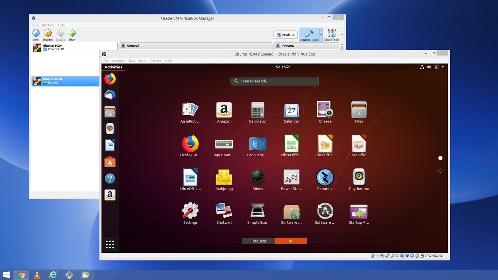
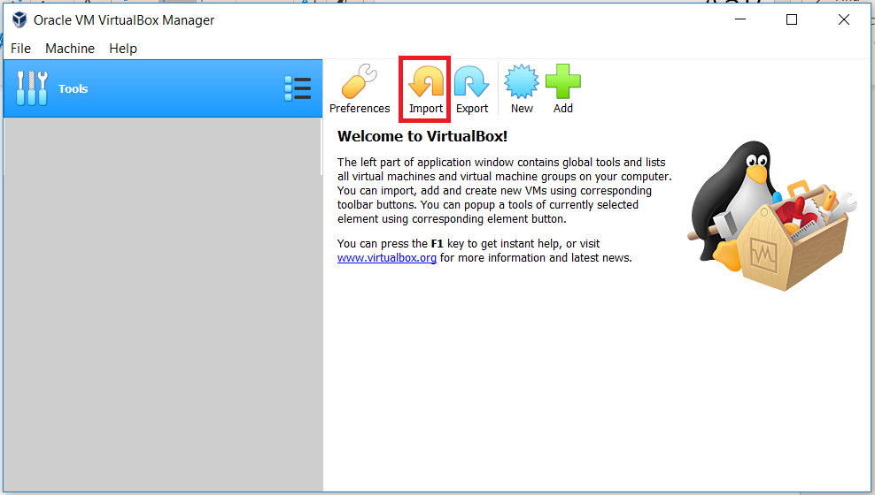
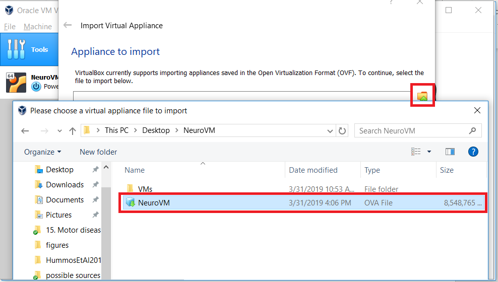
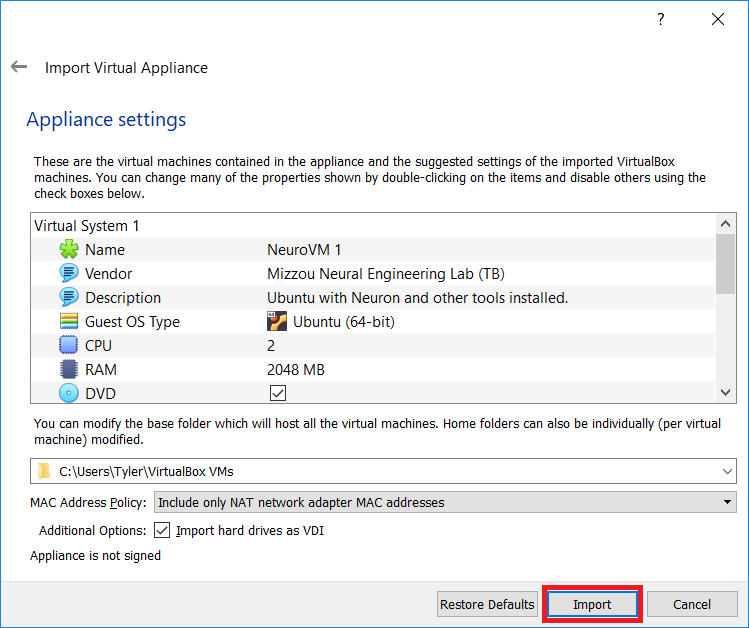
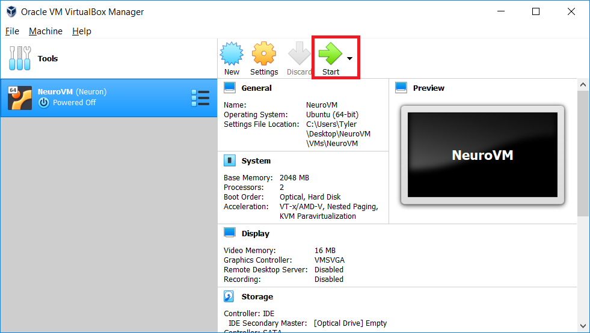
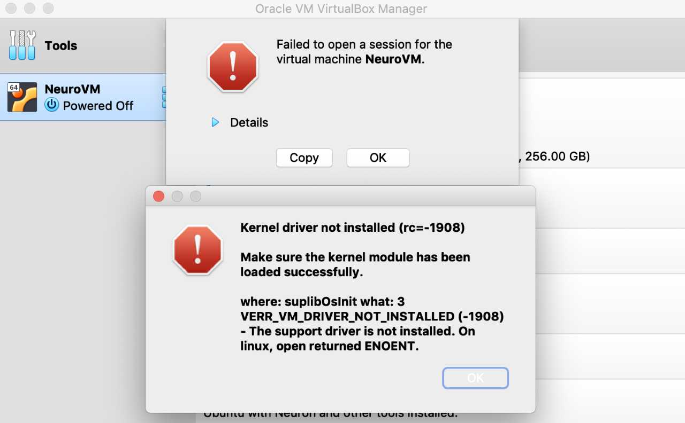
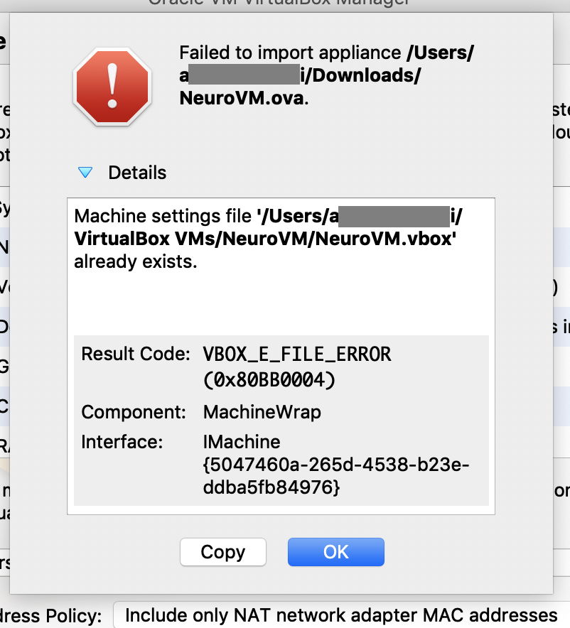

# Computational Neuroscience Virtual Machine

[**Home**](/) > [**Research**](/research) > **Tools** > [**CompNeuroVm**](./)

----



## Information

Download a pre-built virtual appliace with all the tools you need to conduct large scale computational neuroscience simulation.

**<mark>30 GB OF FREE DISK SPACE IS REQUIRED BEFORE INSTALLATION</mark>**

#### Software provided:
* Neuron 7.5 (with IV and MPI) - [​https://www.neuron.yale.edu/neuron/](​https://www.neuron.yale.edu/neuron/)
* Anaconda 3 - ​[https://www.anaconda.com/distribution/](https://www.anaconda.com/distribution/)
* Nest - [​http://www.nest-simulator.org/](​http://www.nest-simulator.org/)
* BMTK - [​https://github.com/Alleninstitute/bmtk](​https://github.com/Alleninstitute/bmtk)
* SimAgentMPI - [​https://tylerbanks.net/SimAgentMPI/](​https://tylerbanks.net/SimAgentMPI/)
* BMTools - [​https://github.com/tjbanks/bmtools](​https://github.com/tjbanks/bmtools)
* VSCode - ​[https://code.visualstudio.com/](https://code.visualstudio.com/)


#### Direct Download

* [Via Google Drive](https://drive.google.com/uc?export=download&confirm=j7WJ&id=11wacrg9pt5IyQVoNndgu9o6Da1yXcZPQ)

## Installation Instructions
Install directions also available in PDF format [here](https://tylerbanks.net/assets/CompNeuroVMInstructions.pdf)
1. Download and install VirtualBox: (Windows, Mac OS and Linux installers available) [https://www.virtualbox.org/wiki/Downloads](https://www.virtualbox.org/wiki/Downloads)
2. Download the CompNeuro Virtual Appliance provided by the Mizzou Neural Engineering Lab: [[DOWNLOAD]](https://drive.google.com/uc?export=download&confirm=j7WJ&id=11wacrg9pt5IyQVoNndgu9o6Da1yXcZPQ) 
3. This file is 8.5GB and will take some time to download. The file may also be available via USB.
4. <mark>Import the appliance in VirtualBox</mark>

5. <mark>Select the downloaded NeuroVM ova file.</mark>

6. <mark>Change settings if needed (increase memory, etc.). This process may take several minutes.</mark>

7. <mark>Start the VM and you’re ready to go!</mark>


## Troubleshooting

### Error -1908


#### To fix this error:
* Visit [https://medium.com/@Aenon/mac-virtualbox-kernel-driver-error-df39e7e10cd8](https://medium.com/@Aenon/mac-virtualbox-kernel-driver-error-df39e7e10cd8)
* If the error persists, uninstall virtualbox, reinstall, and follow the steps again


### NS_ERROR_INVALID_ARG (0x80070057)



#### To fix this error:
* Ensure that you have 30GB of free disk space
* Delete the folder containing your virtual machine import. Usually:
    * /Users/[your username]/VirtualBox VMs/NeuroVM <mark>OR</mark>
    * C:\Users\[your username]\VirtualBox VMs\NeuroVM
* Attempt to re-import

## Reference Material

#### Usage

Ubuntu 18.04LTS is installed

**Username**: mizzou

**Password**: mizzou

The system should automatically log you in, password will only be required when installing additional software. 

VirtualBox tools are available, transferring files from the host system can be done throughdrag and drop.


#### Running Neuron

nrniv, nrngui, nrnivmodl are all available from the terminal.

Navigate to the directory with your model and run from there.

#### Jupyter Notebooks

Open terminal and type

```bash
jupyter notebook
```
The web browser will open and you will be able to navigate to your notebooks.

#### Python and BMTK Code

Python 3.6 will be available from the terminal by default

```bash
python your_program.py
```

## References

* [https://tylerbanks.net](https://tylerbanks.net)


---
*This page is part of a [collection of pages](/) on various topics of Computational Neuroscience. Please direct questions and suggestions to the author [Tyler Banks](https://tylerbanks.net) at [tbanks@mail.missouri.edu](mailto:tbanks@mail.missouri.edu).*
