# Creating an online presence with Google Sites
[**Home**](/) > [**Teaching**](/teaching) > [**Google Sites**](./)

---
Today we’ll be looking at how to publish lessons and custom content on the web using Google Sites. [[Example](https://sites.google.com/view/neuroret/)]

## Motivation
In a world where the Internet has impacted every aspect of life it’s important that students are able to effectively use online resources to access information. By offering an online presence you can augment the student’s learning experience. 
In fact, [(Leung and Ivy)](http://citeseerx.ist.psu.edu/viewdoc/download?doi=10.1.1.581.3422&rep=rep1&type=pdf) found that students perceive course websites to enhance learning. Sites that host content directly related to the student’s final grade were considered most impactful. Presumably as this drives motivation to use and retain information found on the site. 
Google sites is an easy to use and powerful platform that will allow you to host a wide variety of content (documents, videos, etc.)
## Creating the site

### ```Step 1```

Start by opening up a browser window and navigating to [https://sites.google.com](https://sites.google.com) You’ll be presented with a window similar to the following. (**You may need to login or create a google account before proceeding**)

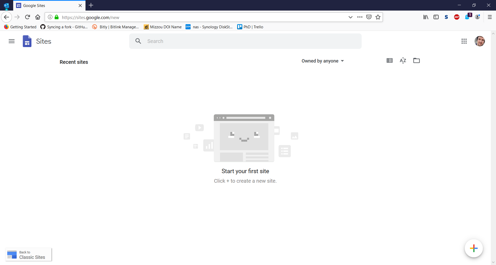

---- 

### ```Step 2```

Next, click the + icon at the bottom right of the screen. You’ll be given a blank template to work with.

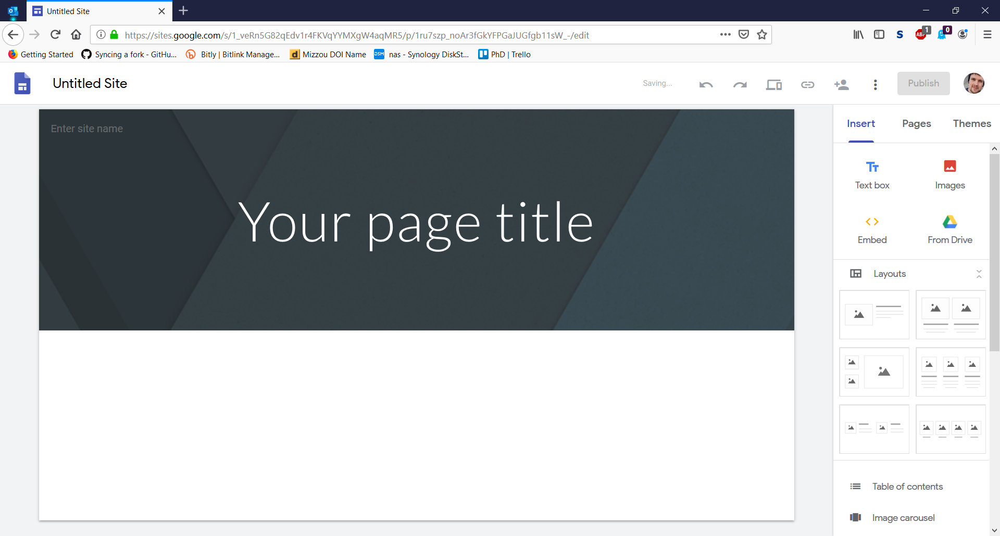


## Customizing your Google Site

### ```Step 3```

Start by giving your site a name, something like “Mrs. Johnson’s Classroom Webpage”

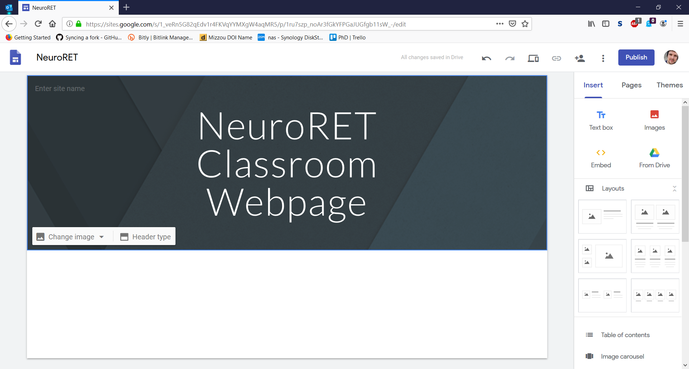

 ----

### ```Step 4```

Next try changing the image background to fit your style. Click “Change Image” then “Select Image.” Alternatively, you can upload your own, custom image. For now, we’ll go with a provided default.

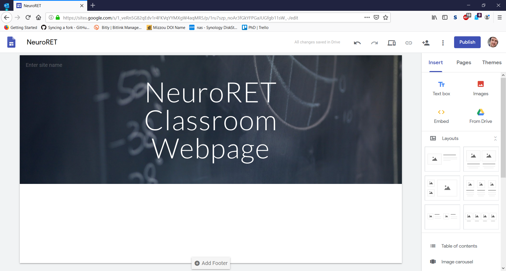

 ----

### ```Step 5```

Next, we’ll need to add a layout for our homepage, and add some information. Select a layout from the right side of the page and add a snippet of information about your new website.

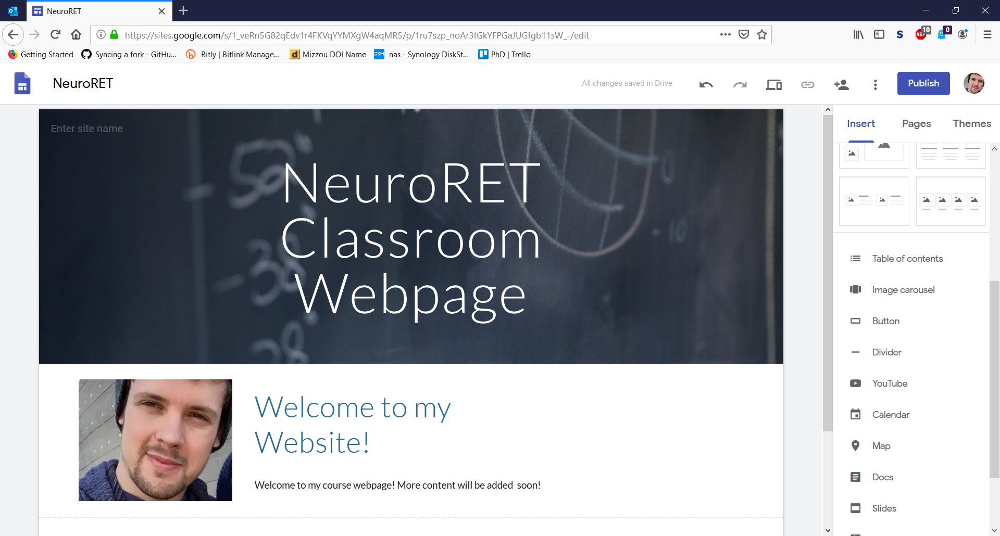

 ----

### ```Step 6```

Now, let’s create a “Lessons” Page. Click pages on the right-hand bar then click the + icon at the bottom right and name your page “Lessons” Click “Done” when you’re finished.

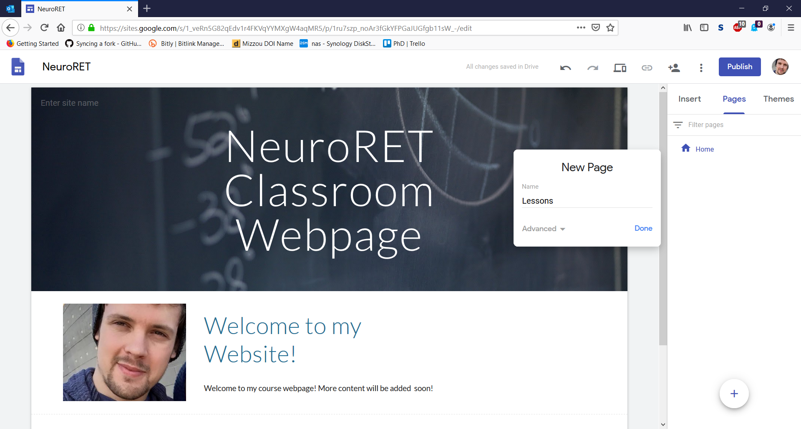

 ----

### ```Step 7```

Now, let’s visit the newly created Lessons page. Click “Lessons” in the top right corner of your homepage.

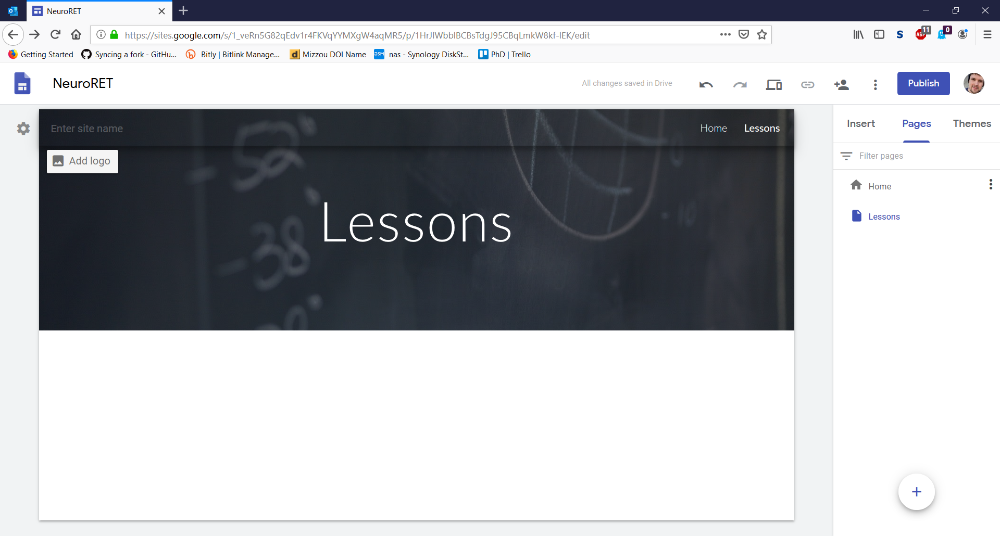

 ----

### ```Step 8```

Let’s now add a subpage for our first lesson. From the Pages tab click the three dots next to “Lessons” and click “New Subpage.” Title your new subpage “Lesson 1 – Neuroscience” and click “Done”

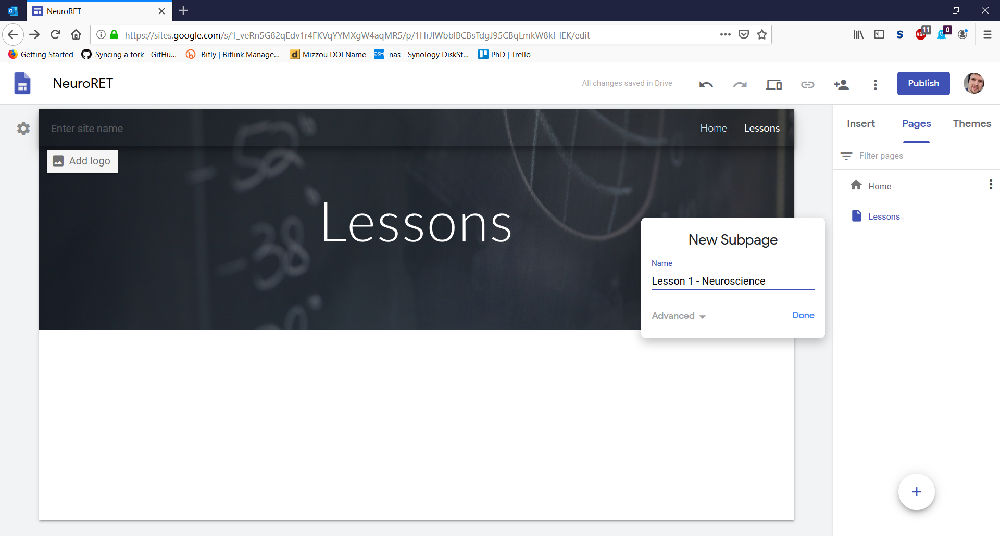

 ----

### ```Step 9```

From here, let’s customize our page by adding content. Add a textbox from the insert tab.

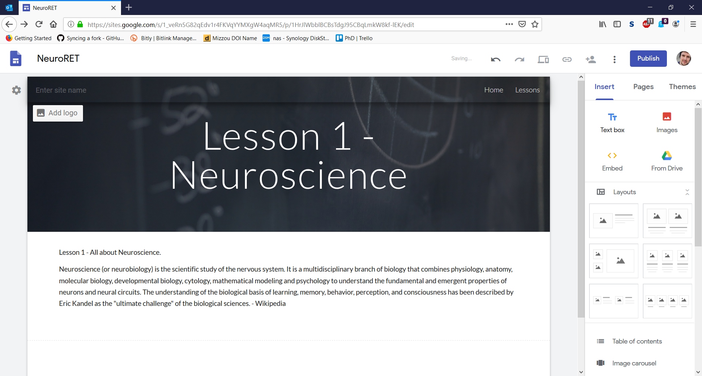

---- 

### ```Step 10```

We can then further extend our lesson by adding a YouTube video. From the same insert tab, scroll down and click “YouTube”. Search for a video and click “Select”

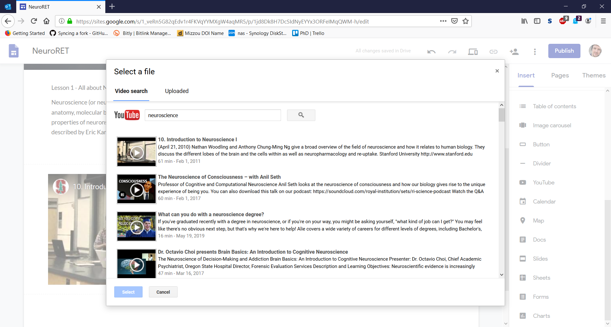

---- 

### ```Step 11```

Next time, we’ll be creating our own YouTube lessons so this will come in handy later.
Finally, let’s add an assignment document to our page. Open a new tab and visit [https://drive.google.com](https://drive.google.com)
Click “+ New” then “Google Docs”

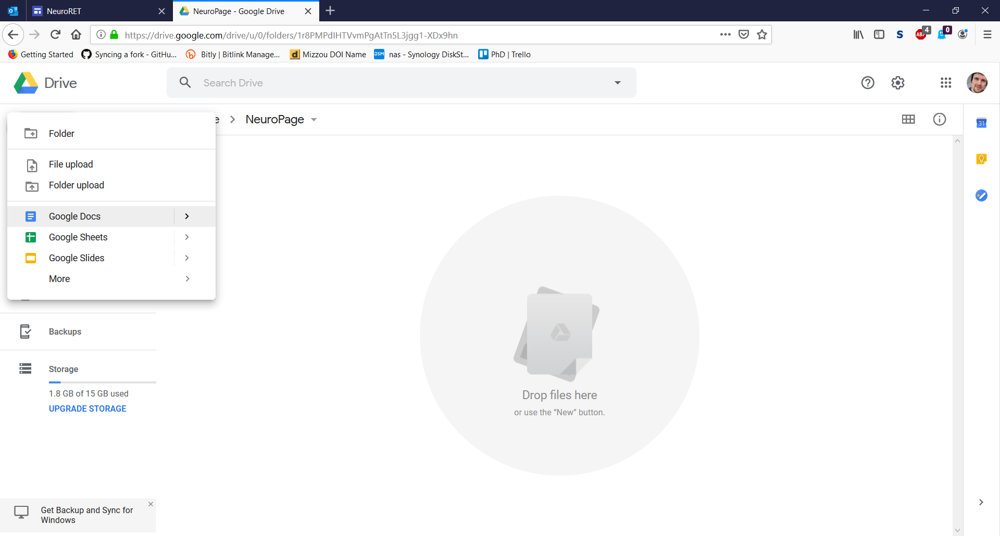

---- 

### ```Step 12```

From this window, write a few questions for the students to answer. Click Untitled document at the top and give the document a name. (NeuroLesson1)

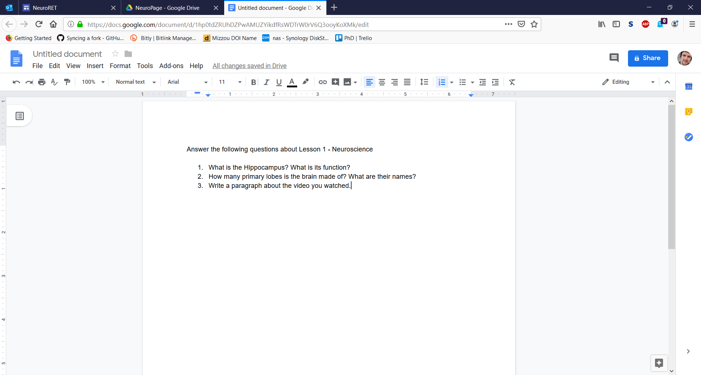

---- 

### ```Step 13```

Now, lets return to our website. From the “Insert” tab click Docs. Click NeuroLesson1 from the options, then “INSERT” at the bottom.

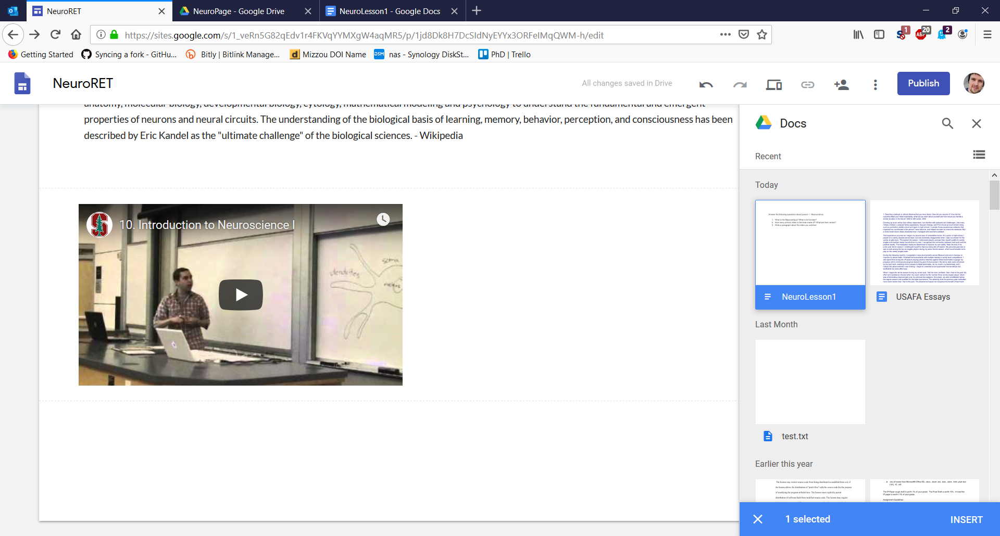

---- 

### ```Step 14```

You should now see your questions from Google docs. Now, whenever you update the document in Google Drive you’ll see the changes here. You can also upload other word document/excel files you’ve previously created and host them here!

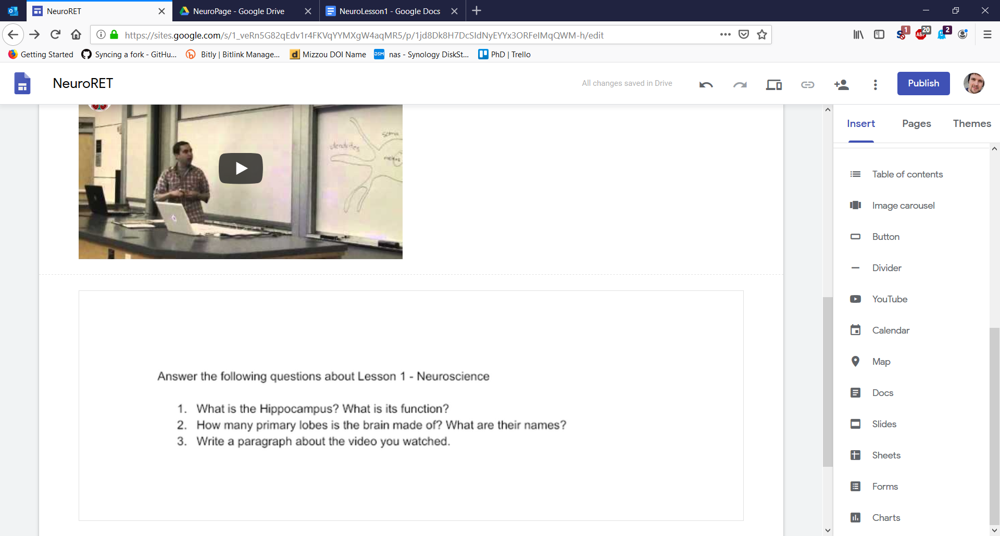

---- 

### ```Step 15```

Finally, let’s return to our homepage and give the site a custom URL. Click “Home” at the top left of your page. From the homepage click “Enter site name” and enter a good name for your website.  It will be accessible through https://sites.google.com/view/<yoursitename> 
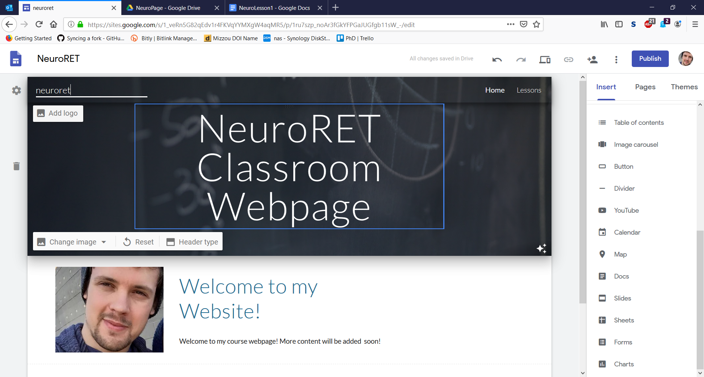

 
## Publishing your site

### ```Step 16```

It’s time to publish! Click “Publish” at the top right of the page. You’ll be presented with a second window, click “Publish” again.

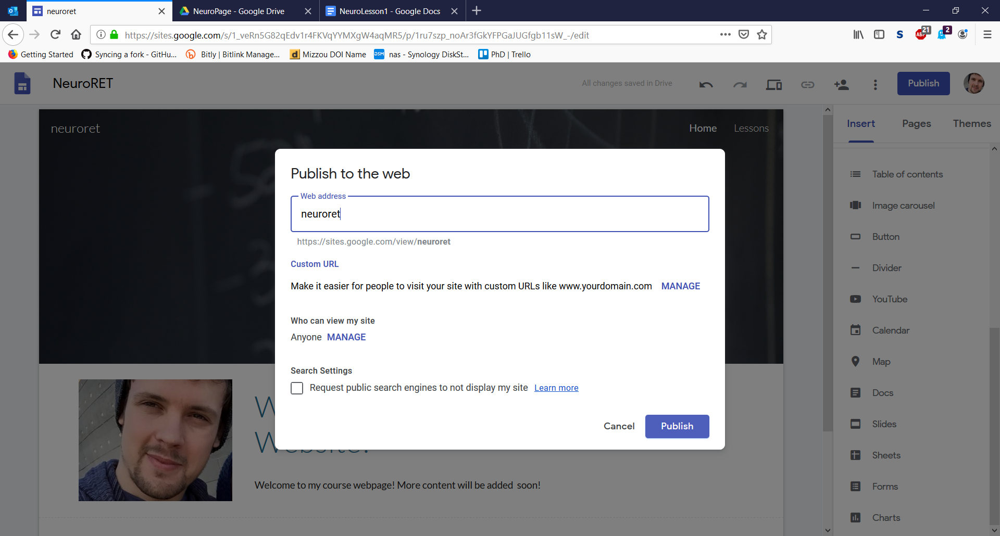

---- 

### ```Step 17```

Congratulations! You’ve just created your first site! Visit https://sites.google.com/view/yoursitename to check it out!

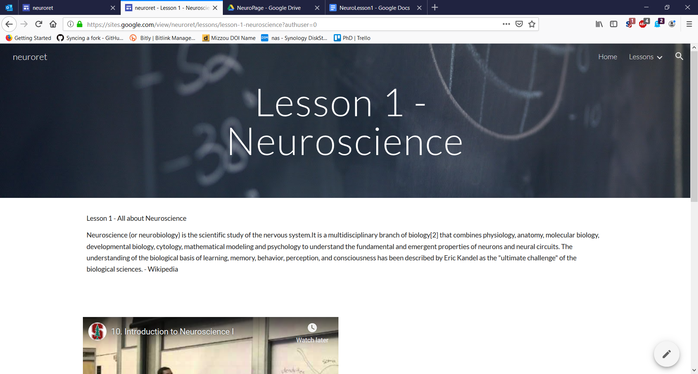

 ----

### ```Step 18```

Return to the editor and check out some of the other options for your page.
You can add items like:
* Calendars
* Maps
* PowerPoint slides
* Questionnaire forms
* Charts
* and even change the theme!


---
*This page is part of a [collection of pages](/) on various topics of Computational Neuroscience. Please direct questions and suggestions to the author [Tyler Banks](https://tylerbanks.net) at [tbanks@mail.missouri.edu](mailto:tbanks@mail.missouri.edu).*
